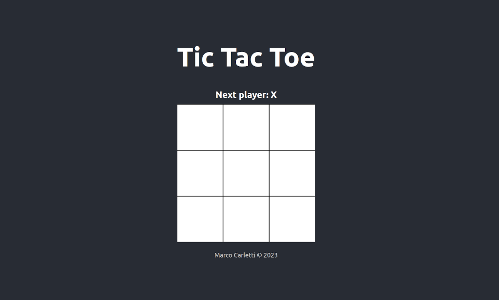

# Tic-Tac-Toe

A React implementation of the classic Tic-Tac-Toe game.
You can play it [here](https://mcarletti.github.io/tictactoe-react/).



## Installation

Clone the repository and install the dependencies.

```bash
git clone git@github.com:mcarletti/tictactoe-react.git
cd tictactoe-react
npm install
```

## Usage

Run the application in development mode.

```bash
npm start
```

## Deployment

Make sure `gh-pages` is installed.

```bash
npm install --save gh-pages
```

Check the `package.json` file and make sure the `homepage` property is set to the correct URL.

```json
"homepage": "https://mcarletti.github.io/tictactoe-react/"
```

The `script` property must have the `deploy` and `predeploy` keys.

```json
"scripts": {
  "predeploy": "npm run build"
  "deploy": "gh-pages -d build",
  ...
}
```

Run the deploy script.

```bash
npm run deploy
```
